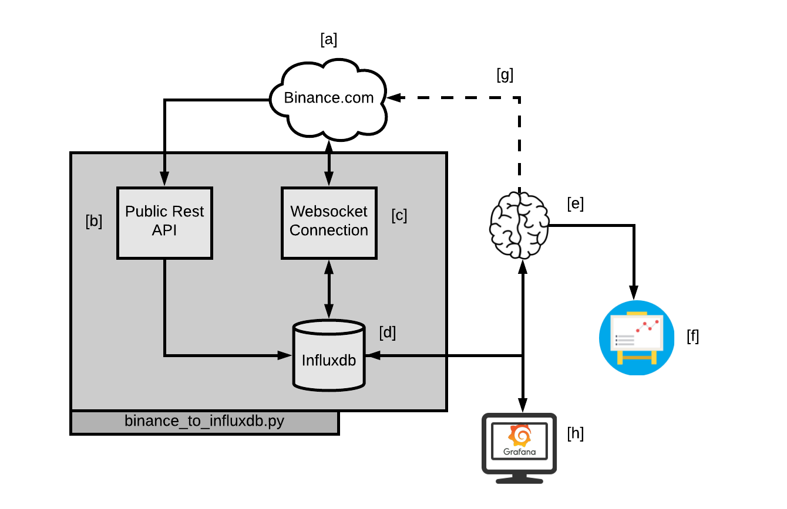

# Here we find the code

### binance_to_influxdb.py

This file is in charge of the following section:

This file contains the class BinanceInfluxdb.

### class BinanceInfluxdb

This class manages the connection between binance and influxdb.
To properly use this class you need to install the following:

 - [binance-python](https://github.com/sammchardy/python-binance)
 - [influxdb-python](https://github.com/influxdata/influxdb-python)

**BinanceInfluxdb class description**

  **Method**                                  | **Purpose**                      
  ----------------------------------------| --------------------------  
  online_process_message                  | This method is executed each time we receive a msg from the websocket connection.        
  get_previous_point                      | Fill the gap between the actual data being received and the last data stored on influxdb. The gap should be less than 2 days. If several days has passed update your data using the *insert_offline_data*.     
  insert_minute_tick_value_into_influxdb  | Insert a datapoint into influxdb.  TODO: insert a set of points.                          
  create_msg_from_history                 | Fetches data from binance and changes the format to match the websocket msg format.                          
  insert_offline_data                     | Fetches data from binance given a time interval TODO: expand the time interval options.                             
  insert_offline_tick_data                | Insert a list of points into influxdb.                            
  msg_data_RSI_calculation                | TODO:                            
  populate_RSI                            | TODO:                            
  websocket_start                         | Establishes a websocket connection to binance that will keep the infludb data updated.                            
  websocket_close                         | Closes the websocket connection.   

